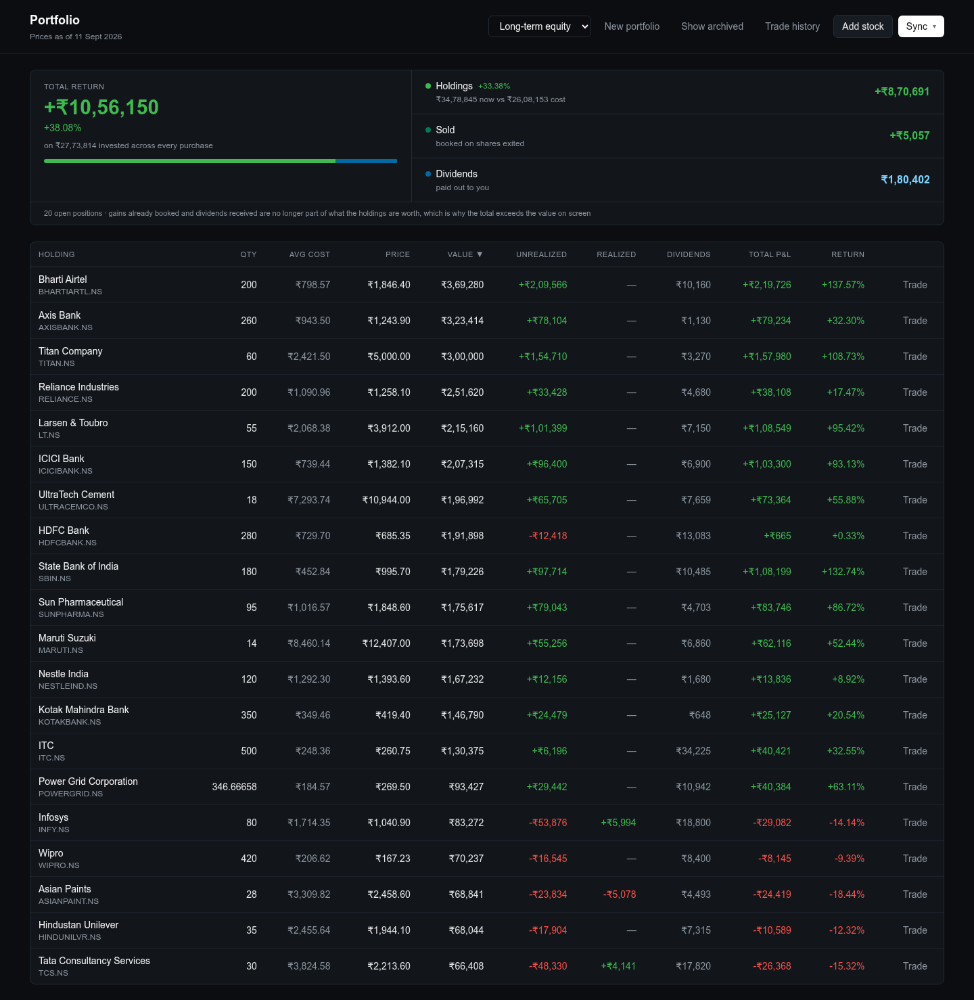
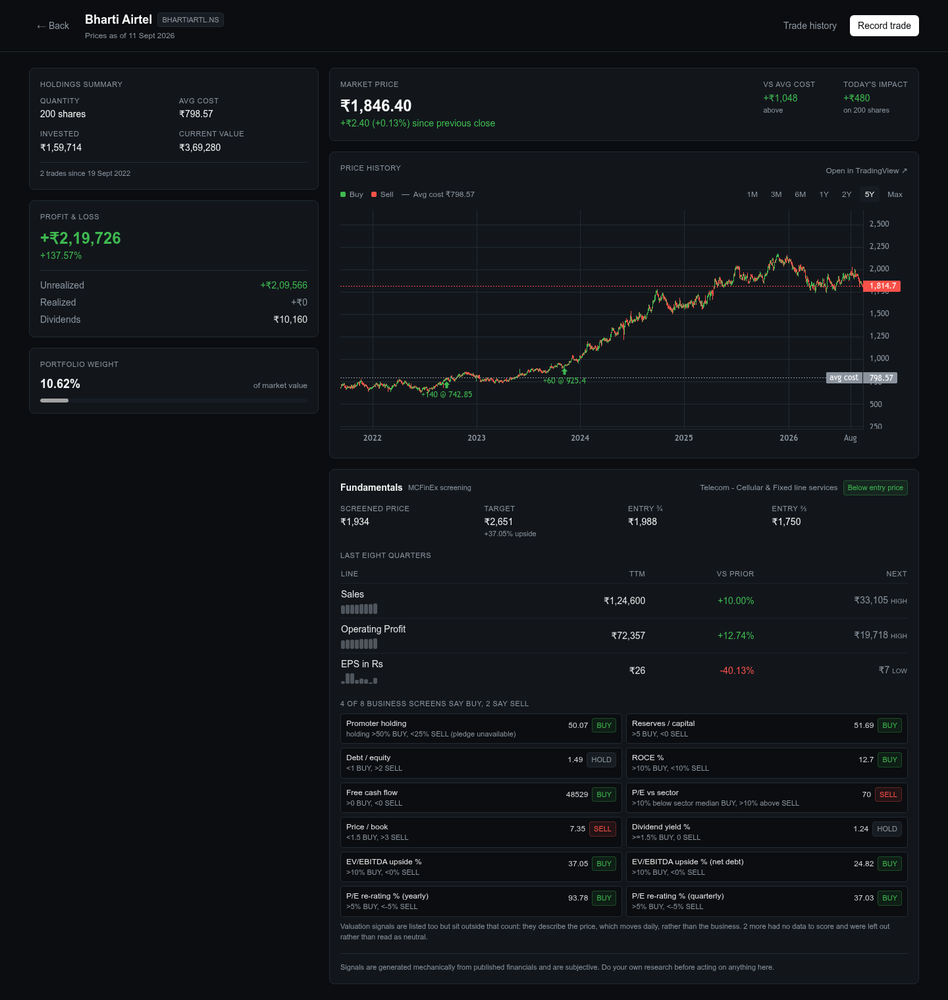
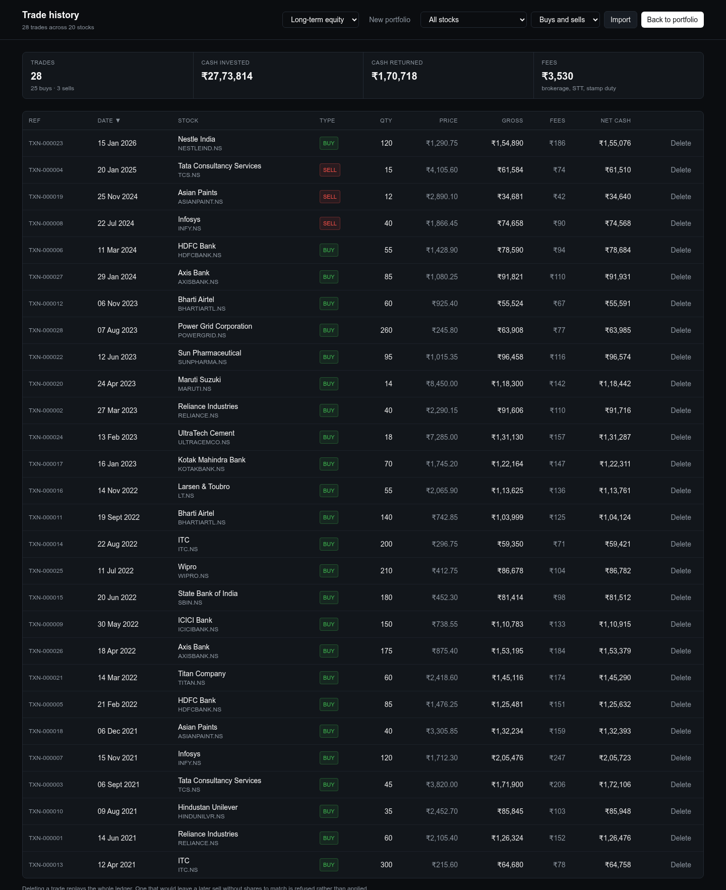
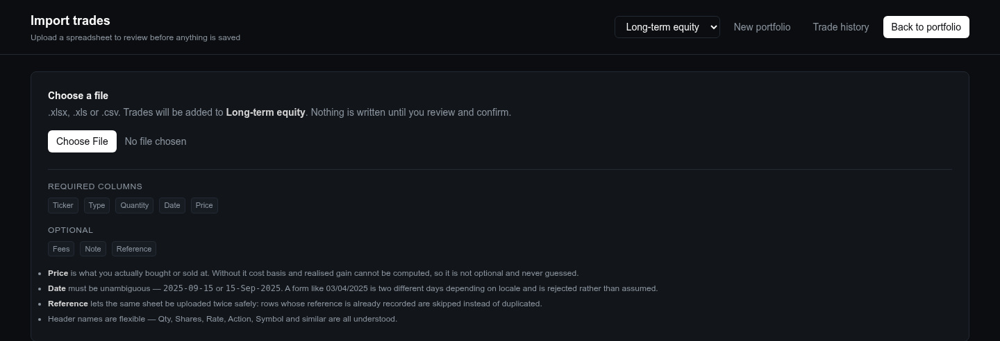

# 📊 Portfolio Tracker

<div align="center">


A comprehensive real-time stock portfolio tracking application built with React/Next.js frontend and Flask backend, integrated with Yahoo Finance API for live market data.

[](https://reactjs.org/)
[](https://nextjs.org/)
[](https://flask.palletsprojects.com/)
[](https://chakra-ui.com/)

</div>

---

## ✨ Features

### 🔥 Real-time Market Data
- **Live Stock Prices**: Fetch real-time stock data using Yahoo Finance API
- **Auto-refresh**: Manual refresh control with loading indicators and notifications
- **Rate Limit Handling**: Smart API management to avoid throttling

### 📈 Portfolio Management
- **Excel Integration**: Import portfolio data from Excel files with precise column mapping
- **Dynamic Calculations**: Real-time P&L calculations, profit percentages, and portfolio totals
- **Smart Fallbacks**: Graceful handling when live data is unavailable

### 🎨 Interactive UI
- **Modern Design**: Clean, responsive interface built with Chakra UI
- **Sortable Tables**: Click-to-sort functionality on all columns with visual indicators
- **Color-coded Performance**: Green/red indicators for gains and losses
- **Mobile Responsive**: Optimized for all screen sizes

### 🔧 Advanced Features
- **Filtering**: Automatically filter out empty or zero-quantity positions
- **Toast Notifications**: Real-time feedback for all user actions
- **Loading States**: Professional loading spinners and progress indicators
- **Error Handling**: Comprehensive error management with user-friendly messages

---

## 🛠️ Tech Stack

<table>
<tr>
<td><strong>Frontend</strong></td>
<td><strong>Backend</strong></td>
</tr>
<tr>
<td>

- **React 18.2.0** - Modern UI library
- **Next.js 13.4.19** - Full-stack React framework
- **Chakra UI 2.8.0** - Component library
- **Axios 1.5.0** - HTTP client
- **Recharts 2.8.0** - Data visualization
- **React Icons 4.11.0** - Icon library
- **Framer Motion 10.16.4** - Animations

</td>
<td>

- **Flask 2.3.3** - Lightweight web framework
- **Yahooquery 2.3.7** - Yahoo Finance API client
- **Pandas 2.0.3** - Data manipulation
- **OpenPyXL 3.1.2** - Excel file handling
- **Flask-CORS 4.0.0** - Cross-origin requests

</td>
</tr>
</table>

---

## 🚀 Quick Start

### Prerequisites

Ensure you have the following installed:
- **Node.js** (v16+ recommended) and npm
- **Python 3.8+** and pip
- Your portfolio data in Excel format

### Installation

1. **Clone the repository**
   ```bash
   git clone https://github.com/D4T4R/portfolio-tracker.git
   cd portfolio-tracker
   ```

2. **Setup Backend**
   ```bash
   cd backend
   pip install -r requirements.txt
   python app.py
   ```
   > Backend will run on `http://localhost:5000`

3. **Setup Frontend** (in a new terminal)
   ```bash
   cd frontend
   npm install
   npm run dev
   ```
   > Frontend will run on `http://localhost:3000`

4. **Configure Excel File**
   - Place your Excel portfolio file in the project root
   - Use the application to set the Excel file path via the API

---

## 📋 Usage

### 🏠 Main Dashboard
- View your portfolio overview with live stock prices
- Individual stock cards showing current price, change, and percentage
- Quick navigation between portfolio views

### 📊 Portfolio Table
- Detailed tabular view of your entire portfolio
- Sort by any column (Symbol, Price, Quantity, P&L, etc.)
- Filter automatically removes empty positions
- Total row showing portfolio summary
- Manual refresh with loading states

### 🔧 Configuration
- Set Excel file path through the backend API
- Customize refresh intervals and display preferences

---

## 📁 Project Structure

```
portfolio-tracker/
├── frontend/                 # Next.js React application
│   ├── components/          # Reusable UI components
│   │   ├── Navigation.js    # Navigation bar
│   │   ├── Portfolio.js     # Portfolio table component
│   │   └── StockCard.js     # Individual stock display
│   ├── pages/               # Next.js pages
│   │   ├── _app.js         # App wrapper with Chakra UI
│   │   ├── index.js        # Main dashboard
│   │   └── portfolio.js    # Portfolio table page
│   ├── styles/             # CSS modules
│   └── package.json        # Frontend dependencies
├── backend/                 # Flask API server
│   ├── app.py              # Main Flask application
│   └── requirements.txt    # Python dependencies
├── .gitignore              # Git ignore rules
└── README.md               # This file
```

---

## 🔗 API Endpoints

### Market Data
- `GET /api/prices` - Live prices for every tracked ticker
- `GET /api/stocks` - The name → NSE symbol map
- `GET /api/detailed/<stock_name>` - Quote detail for one stock
- `GET /api/historical/<symbol>?period=1mo&interval=1d` - OHLCV history

### Portfolio
- `POST /api/set-excel-path` - Point the API at a workbook (must live under `PORTFOLIO_DATA_DIR`)
- `GET /api/portfolio-data` - Positions parsed from the workbook
- `GET /api/portfolio-with-live-prices` - Positions valued at live prices, plus summary totals

Live-price responses carry a `pricesLive` flag. When Yahoo Finance rate-limits,
`/api/prices` returns `503` and `/api/portfolio-with-live-prices` falls back to the
workbook's stored CMP column with `pricesLive: false` — the UI surfaces that rather
than presenting stale figures as current.

### Configuration

| Variable | Default | Purpose |
|---|---|---|
| `PORTFOLIO_EXCEL_PATH` | unset | Workbook to load at startup |
| `PORTFOLIO_DATA_DIR` | `$HOME` | Directory `set-excel-path` is confined to |
| `CORS_ALLOWED_ORIGINS` | `http://localhost:3000,http://localhost:3001` | Permitted browser origins |
| `PRICE_CACHE_TTL` | `60` | Seconds to reuse an upstream price fetch |
| `FLASK_DEBUG` | off | Enables the Werkzeug debugger (never set in production) |

---

## 🎯 Key Features Explained

### Excel Integration
The application reads your Excel portfolio file and maps columns correctly:
- **Symbol** (Column A) - Stock ticker symbols
- **Average Price** (Column B) - Your average buy price
- **Initial Quantity** (Column C) - Starting position
- **Current Quantity** (Column D) - Current holdings
- **Dividends** (Column E) - Dividend income
- **Realized Profit** (Column F) - Profit from sold positions

### Smart Calculations
- **Current Value**: Live price × quantity
- **Invested Value**: Average price × quantity (capital still in the market)
- **Cost Basis**: Average price × initial quantity (all capital ever deployed)
- **Unrealized P&L**: Current value − invested value
- **Unrealized %**: Unrealized P&L / invested value × 100
- **Total Profit**: Unrealized + realized + dividends, each counted **once**
- **Total Return %**: Total profit / cost basis × 100

> Realized gains were earned on shares that have since been sold, so they are
> measured against cost basis rather than the capital still invested. Note that
> the source workbook's own `TOTAL` row computes `=SUM(J)+SUM(L)` while each `J`
> is already `SUM(I, H, L)` — that double-counts realized profit, and the API
> deliberately does not reproduce it.

### Error Handling
- Graceful fallback to Excel values when API fails
- Rate limit detection and user notification
- Empty position filtering
- Comprehensive error logging

---

## 🤝 Contributing

We welcome contributions! Here's how you can help:

1. **Fork** the repository
2. **Create** a feature branch (`git checkout -b feature/amazing-feature`)
3. **Commit** your changes (`git commit -m 'Add amazing feature'`)
4. **Push** to the branch (`git push origin feature/amazing-feature`)
5. **Open** a Pull Request

### Development Guidelines
- Follow existing code style and conventions
- Add comments for complex logic
- Test your changes thoroughly
- Update documentation as needed

---

## 📝 License

This project is licensed under the MIT License - see the [LICENSE](LICENSE) file for details.

---

## 🙏 Acknowledgments

- **Yahoo Finance** for providing free stock data API
- **Chakra UI** for the excellent component library
- **Next.js** team for the amazing React framework
- **Flask** community for the lightweight web framework

---

## 📬 Contact & Support

- **Issues**: [GitHub Issues](https://github.com/D4T4R/portfolio-tracker/issues)
- **Discussions**: [GitHub Discussions](https://github.com/D4T4R/portfolio-tracker/discussions)

---

<div align="center">

**⭐ Star this repository if you find it helpful!**

Made with ❤️ by [D4T4R](https://github.com/D4T4R)


</div>

---

## 📸 Screens

> Every figure below comes from a generated demo book — twenty real NSE tickers
> with invented quantities, prices and dates. Prices, dividends and splits are
> live, so the arithmetic is real; the holdings are not anyone's.

### Dashboard

Positions sorted by value, with unrealised, realised and dividend income kept in
separate columns. Total return is measured against every rupee ever deployed,
not just the capital still in the market — which is why it exceeds the holdings
figure beside it.



### One holding in full

Holdings summary, P&L and portfolio weight on the left; live price, chart and
the screener's read on the company down the right.

The chart is TradingView's lightweight-charts rendering this book's own data
rather than their embedded widget, which buys the one thing an iframe cannot do:
**your actual buys and sells marked on the series**, with the average-cost line
beside them. Markers are restated for splits, so a trade from before a 1:10 sits
at the price the rest of the page quotes it at.



### Trade history

The ledger itself. Positions are derived from these rows at read time and never
stored, so there is no total that can drift away from the trades behind it.



### Import

Spreadsheets are parsed and shown for review before anything is written. A
`Reference` column makes re-uploading the same sheet a no-op rather than a
duplicate.



